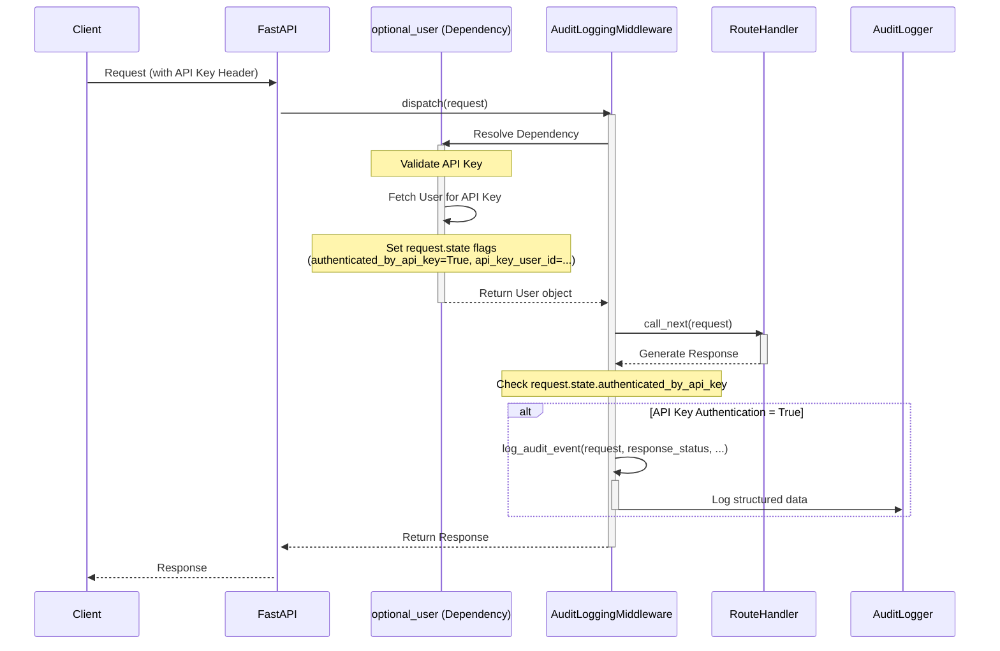

# RFC 08: API Key Request Audit Logging

| Field       | Value                                      |
| ----------- | ------------------------------------------ |
| Author      | Assistant                                  |
| Date        | 2024-07-26                                 |
| Revision    | 1                                          |
| Notes       | Initial proposal for API key audit logging |
| Implemented | Yes                                        |

## Table of Contents

- [Context and Background](#context-and-background)
- [Current Implementation Analysis](#current-implementation-analysis)
- [Proposed Solution](#proposed-solution)
  - [Architecture Changes](#architecture-changes)
  - [Sequence Diagram](#sequence-diagram)
  - [Key Components](#key-components)
  - [Log Entry Structure](#log-entry-structure)
- [Technical Implementation Details](#technical-implementation-details)
  - [1. Modify Authentication Logic](#1-modify-authentication-logic)
  - [2. Create Audit Logging Middleware](#2-create-audit-logging-middleware)
  - [3. Register Middleware](#3-register-middleware)
  - [4. Configure Logging](#4-configure-logging)
- [Success Criteria](#success-criteria)
  - [Functional Requirements](#functional-requirements)
  - [Non-Functional Requirements](#non-functional-requirements)
- [Resource Requirements](#resource-requirements)
  - [Development Team](#development-team)
  - [Infrastructure](#infrastructure)
- [Support and Documentation](#support-and-documentation)
  - [Documentation Updates](#documentation-updates)
  - [Monitoring Plan](#monitoring-plan)
  - [Logging Strategy](#logging-strategy)

## Context and Background

Currently, while general request logging might exist, there is no dedicated audit trail specifically capturing actions performed using API keys. For enhanced security posture, compliance requirements, and traceability, it's crucial to log all requests authenticated via API keys. This RFC proposes implementing a robust audit logging mechanism for this specific authentication method.

## Current Implementation Analysis

There is no dedicated system in place to generate audit logs specifically for requests authenticated using API keys. Existing logging might capture some request details, but lacks the focused, structured information required for a security audit trail tied directly to API key usage. This gap makes it difficult to track actions performed by specific API keys, investigate potential misuse, or meet certain compliance standards.

## Proposed Solution

### Architecture Changes

1.  **Introduce FastAPI Middleware:** Implement a new middleware (`AuditLoggingMiddleware`) that intercepts all incoming requests and outgoing responses.
2.  **Authentication Signaling:** Modify the existing authentication logic (`optional_user` in `backend/aura/auth/users.py`) to detect successful API key authentication and signal this to the middleware using `request.state`.
3.  **Conditional Logging:** The middleware will check the signal on `request.state`. If a request was authenticated via an API key, it will generate a structured audit log entry _after_ the request has been processed and the response is generated (or an error occurred).
4.  **Dedicated Logger:** Utilize a dedicated logger namespace (e.g., `audit`) for these specific logs to allow separate configuration and routing if needed.

### Sequence Diagram



### Key Components

1.  **Modified `optional_user` (in `backend/aura/auth/users.py`)**

    ```python
    # Snippet showing the change
    async def optional_user(
        request: Request,
        # ... other params ...
    ) -> User | None:
        request.state.authenticated_by_api_key = False
        request.state.api_key_user_id = None
        # ... existing logic ...

        # If API Key is provided, use that
        api_key = get_hashed_api_key_from_request(request=request)
        if api_key:
            user = await fetch_user_for_api_key(api_key, async_db_session)
            if user:
                # <<< CHANGE START >>>
                request.state.authenticated_by_api_key = True
                request.state.api_key_user_id = str(user.id) # Store associated user ID
                # <<< CHANGE END >>>
                await update_user_profile(user=user, async_db_session=async_db_session)
                return user
            else:
                raise BasicAuthenticationError(detail="Invalid API key provided")
        # ... rest of the function ...
    ```

2.  **`AuditLoggingMiddleware` (in `backend/aura/server/middleware/audit_logging.py`)**

    ```python
    # See Technical Implementation Details section for full code
    class AuditLoggingMiddleware(BaseHTTPMiddleware):
        async def dispatch(self, request: Request, call_next: RequestResponseEndpoint) -> Response:
            # ... timing, request_id setup ...
            # ... initialize request.state ...
            try:
                response = await call_next(request)
                # ... capture status, process_time ...
            except Exception:
                # ... handle exception, log attempt if API key auth ...
                raise

            # Log after response if authenticated by API key
            if getattr(request.state, 'authenticated_by_api_key', False):
                self.log_audit_event(...) # Call the logging function

            return response

        def log_audit_event(self, request: Request, response_status: int, process_time: float) -> None:
            # ... gather log data ...
            audit_logger.info(log_data) # Log structured data
    ```

### Log Entry Structure

Audit logs will be structured (e.g., JSON format when using appropriate handlers) containing the following fields:

```json
{
  "timestamp": "2024-07-26T10:30:00.123Z", // Added by logger automatically
  "level": "INFO", // Added by logger automatically
  "logger_name": "audit", // Added by logger automatically
  "audit_event": true, // Flag for filtering
  "request_id": "unique-uuid-per-request",
  "user_id": "uuid-of-user-associated-with-key",
  "auth_method": "api_key",
  "client_ip": "requester's IP address",
  "method": "HTTP method (e.g., GET, POST)",
  "path": "requested API endpoint path",
  "query_params": "string representation of query parameters", // Note: Consider sensitivity
  "status_code": "HTTP status code of the response",
  "latency_ms": "request processing time in milliseconds",
  "user_agent": "User-Agent header from request"
}
```

_Note: Request/response bodies will **not** be logged for security and performance reasons._

## Technical Implementation Details

### 1. Modify Authentication Logic

Update the `optional_user` function within `backend/aura/auth/users.py` to set flags on `request.state` upon successful API key authentication.

```python
# backend/aura/auth/users.py

# Add these lines inside optional_user, near the start
request.state.authenticated_by_api_key = False
request.state.api_key_user_id = None

# Modify the API key handling block:
api_key = get_hashed_api_key_from_request(request=request)
if api_key:
    user = await fetch_user_for_api_key(api_key, async_db_session)
    if user:
        # <<< ADD THESE LINES >>>
        request.state.authenticated_by_api_key = True
        request.state.api_key_user_id = str(user.id)
        # <<< END ADDITION >>>

        await update_user_profile(user=user, async_db_session=async_db_session)
        return user
    else:
        # Important: Do NOT set the flags if the key is invalid
        raise BasicAuthenticationError(detail="Invalid API key provided")

```

### 2. Create Audit Logging Middleware

Create a new file: `backend/aura/server/middleware/audit_logging.py`

```python
# backend/aura/server/middleware/audit_logging.py
import time
from uuid import uuid4

from fastapi import Request, Response
from starlette.middleware.base import BaseHTTPMiddleware, RequestResponseEndpoint
from starlette.types import ASGIApp

from aura.utils.logger import setup_logger

# Use a dedicated logger for audit events
audit_logger = setup_logger("audit")

class AuditLoggingMiddleware(BaseHTTPMiddleware):
    def __init__(self, app: ASGIApp):
        super().__init__(app)

    async def dispatch(
        self, request: Request, call_next: RequestResponseEndpoint
    ) -> Response:
        start_time = time.time()
        request_id = str(uuid4()) # Unique ID for tracing this request

        # Ensure state attributes exist even if auth dependency isn't run (e.g., public routes)
        if not hasattr(request.state, 'authenticated_by_api_key'):
             request.state.authenticated_by_api_key = False
             request.state.api_key_user_id = None

        # Make request ID available elsewhere if needed (e.g., within route handlers)
        request.state.request_id = request_id

        response_status = 500 # Default in case of unexpected exit
        try:
            response = await call_next(request)
            process_time = time.time() - start_time
            response_status = response.status_code # Get status from actual response
            # Optional: Add request ID to response header for client-side correlation
            response.headers["X-Request-ID"] = request_id
        except Exception:
             # Log the attempt even if an unhandled exception occurred during processing
             process_time = time.time() - start_time
             if getattr(request.state, 'authenticated_by_api_key', False):
                self.log_audit_event(
                    request=request,
                    response_status=response_status, # Will likely be 500 here
                    process_time=process_time,
                )
             raise # Important: Re-raise exception to allow standard error handling

        # Log *after* the request is processed, only if API key was used
        if getattr(request.state, 'authenticated_by_api_key', False):
            self.log_audit_event(
                request=request,
                response_status=response_status,
                process_time=process_time
            )

        return response

    def log_audit_event(
        self,
        request: Request,
        response_status: int,
        process_time: float,
    ) -> None:
        # Retrieve the user ID stored during authentication
        user_id = getattr(request.state, 'api_key_user_id', 'UNKNOWN')
        # Retrieve the unique request ID
        req_id = getattr(request.state, 'request_id', 'UNKNOWN')

        log_data = {
            "audit_event": True, # Easy filtering flag
            "request_id": req_id,
            "user_id": user_id, # User associated with the API key
            "auth_method": "api_key",
            "client_ip": request.client.host if request.client else "UNKNOWN",
            "method": request.method,
            "path": request.url.path,
            "query_params": str(request.query_params), # CAUTION: Logged as string, check sensitivity
            "status_code": response_status,
            "latency_ms": round(process_time * 1000, 2),
            "user_agent": request.headers.get("user-agent", "UNKNOWN"),
        }

        # Log the structured data using the dedicated audit logger
        audit_logger.info(log_data)

```

### 3. Register Middleware

Add the `AuditLoggingMiddleware` to the FastAPI application stack in `backend/aura/main.py`. Ensure it's placed after CORS but potentially before other application-specific middleware if order matters for state propagation.

```python
# backend/aura/main.py
# ... other imports ...
from aura.server.middleware.audit_logging import AuditLoggingMiddleware # Import the new middleware

def get_application() -> FastAPI:
    application = FastAPI(...)

    # ... Exception handlers ...

    application.add_middleware(
        CORSMiddleware,
        # ... CORS config ...
    )

    # Add Audit Logging Middleware HERE
    # Place it relatively early in the stack to capture most requests
    application.add_middleware(AuditLoggingMiddleware)

    # ... Other middleware (like latency logging) ...
    # ... Include routers ...
    # ... Auth checks ...

    return application
```

### 4. Configure Logging

Ensure the logging configuration (e.g., in `uvicorn` setup or a dedicated logging config file) handles the `audit` logger namespace. Initially, this can log to the console or a file. For production, routing these logs to a dedicated security information and event management (SIEM) system or a separate log aggregation platform is recommended.

## Success Criteria

### Functional Requirements

- An audit log entry **is generated** for every request successfully authenticated using an API key.
- An audit log entry **is generated** even if the request fails _after_ successful API key authentication (e.g., 4xx or 5xx response).
- Audit log entries **are not generated** for requests using other authentication methods (e.g., web sessions/cookies) or for unauthenticated requests.
- All fields specified in the [Log Entry Structure](#log-entry-structure) are present and correctly populated in each audit log entry.
- Logs are written to the configured destination (console, file, or external system).

### Non-Functional Requirements

- The added latency per request due to the middleware should be minimal (e.g., target < 5 milliseconds on average).
- The middleware should handle concurrent requests correctly without race conditions related to `request.state`.
- The middleware should not cause application crashes, even if logging fails (errors during logging itself should be handled gracefully, potentially logged to a standard error stream, without crashing the request).

## TODO: Implementation Progress

- [x] **Phase 1: Core Logic & Basic Logging**
  - [x] Modify `optional_user` in `backend/aura/auth/users.py` to set `request.state` flags.
  - [x] Create basic `AuditLoggingMiddleware` in `backend/aura/server/middleware/audit_logging.py` with `print` statement.
  - [x] Register `AuditLoggingMiddleware` in `backend/aura/main.py`.
  - [x] **Validate:** Basic console output appears _only_ for successful API key requests.
- [x] **Phase 2: Structured Logging & Dedicated Logger**
  - [x] Add `audit_logger = setup_logger("audit")`.
  - [x] Implement `log_audit_event` method with structured data gathering.
  - [x] Replace `print` with `self.log_audit_event(...)` call in `dispatch`.
  - [x] Add timing logic and `request_id` generation/state storage.
  - [x] Configure basic development logging to show `audit` logger output.
  - [x] **Validate:** Structured logs appear in console for API key requests with correct data.
- [x] **Phase 3: Error Handling & Refinements**
  - [x] Implement `try...except...finally` block in `dispatch` for guaranteed logging.
  - [x] Add `X-Request-ID` header to successful responses.
  - [x] Add `log_query_params` configuration option.
  - [x] Create unit tests (`test_audit_logging.py`) covering various scenarios.
  - [x] **Validate:** Unit tests pass, error scenarios log correctly, header is present.
- [x] **Phase 4: Production Logging Configuration**
  - [x] Add JSON Formatter specifically for 'audit' logger.
  - [x] Fix JSON structure to avoid duplication for GCP `jsonPayload`.
  - [x] Existing file logging + rotation in `setup_logger` deemed sufficient.
  - [ ] **Validate:** Logs are correctly routed and formatted in the production(-like) environment (Manual Step).

## Resource Requirements

### Development Team

- Backend Developer: 1 (Estimated 0.5 - 1 day for implementation and unit tests)
- QA Engineer: 1 (Estimated 0.5 days for testing and verification)

### Infrastructure

- No new infrastructure is strictly required for the initial implementation (logging to console/file).
- Consideration needed for log storage, rotation, and potential integration with a central logging system (e.g., ELK, Splunk, Datadog) in a production environment. This might incur costs or require configuration effort depending on the chosen solution.

## Support and Documentation

### Documentation Updates

1.  Update internal development documentation regarding logging practices to include the new audit log.
2.  Document the structure and location of the API key audit logs for security and operations teams.
3.  Add a section on how to query/access these audit logs.

### Monitoring Plan

1.  Monitor the volume of audit logs generated – sudden spikes or drops might indicate issues.
2.  Set up alerts if the `audit` logger itself reports errors (indicating a failure in the logging process).
3.  Ensure log rotation and retention policies are in place for the audit log destination.

### Logging Strategy

- **Initial Phase:** Log to console/standard log files using the dedicated `audit` logger namespace. Configure logging formatters to output structured JSON for easier parsing.
- **Production:** Integrate with a centralized logging platform (SIEM or log aggregation tool). Ensure appropriate access controls are placed on audit logs. Define log retention periods according to security policies and compliance requirements.
