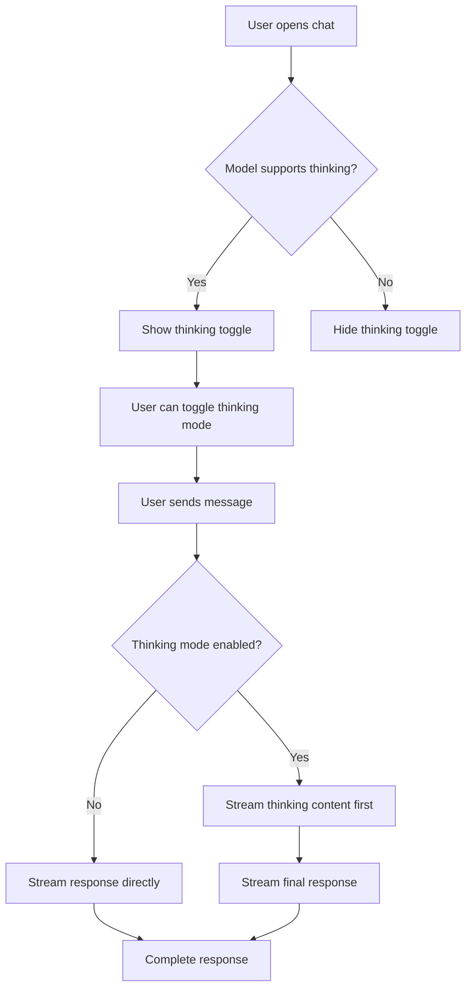

# RFC 09: Thinking Mode UI Implementation

| Field       | Value                                 |
| ----------- | ------------------------------------- |
| Author      | Assistant                             |
| Date        | 2024-12-19                            |
| Revision    | 1                                     |
| Notes       | Initial proposal for Thinking mode UI |
| Implemented | No                                    |

## Table of Contents

- [Context and Background](#context-and-background)
- [Current Implementation Analysis](#current-implementation-analysis)
- [Proposed Solution](#proposed-solution)
  - [Architecture Changes](#architecture-changes)
  - [User Experience Flow](#user-experience-flow)
  - [Component Design](#component-design)
  - [Message Structure](#message-structure)
- [Technical Implementation Details](#technical-implementation-details)
  - [1. Enhanced Message Interface](#1-enhanced-message-interface)
  - [2. Thinking Mode Toggle Component](#2-thinking-mode-toggle-component)
  - [3. Streaming Message Component](#3-streaming-message-component)
  - [4. Model Capability Detection](#4-model-capability-detection)
  - [5. Chat Interface Updates](#5-chat-interface-updates)
- [User Interface Specifications](#user-interface-specifications)
  - [Toggle Control Design](#toggle-control-design)
  - [Thinking Display Design](#thinking-display-design)
  - [Streaming Animation](#streaming-animation)
  - [Responsive Behavior](#responsive-behavior)
- [Success Criteria](#success-criteria)
  - [Functional Requirements](#functional-requirements)
  - [Non-Functional Requirements](#non-functional-requirements)
- [Resource Requirements](#resource-requirements)
  - [Development Team](#development-team)
  - [Infrastructure](#infrastructure)
- [Support and Documentation](#support-and-documentation)
  - [Documentation Updates](#documentation-updates)
  - [Testing Strategy](#testing-strategy)

## Context and Background

The current chat interface provides a basic messaging experience with simulated responses. However, modern AI models like OpenAI's o1-preview support "thinking mode" where the model's reasoning process is exposed to users. This feature enhances transparency, educational value, and user trust by showing how the AI arrives at its conclusions.

Currently, the application has:

- Basic message bubbles (user/assistant)
- Model selection with `thinkingSupported` flag already defined
- Simulated typing indicators
- No real streaming or thinking mode implementation

## Current Implementation Analysis

### Existing Components

1. **ChatInterface** (`components/chat-interface.tsx`): Main chat component with basic message handling
2. **ModelSelector** (`components/model-selector/model-selector.tsx`): Model selection with capability awareness
3. **Models Configuration** (`lib/models.ts`): Contains `thinkingSupported` boolean for each model

### Current Limitations

- No UI for toggling thinking mode
- No support for streaming thinking content
- Messages only support simple text content
- No distinction between reasoning and final answer content
- No visual indicators for thinking-capable models

## Proposed Solution

### Architecture Changes

1. **Enhanced Message Structure**: Extend the message interface to support thinking content alongside regular content
2. **Thinking Mode State Management**: Add global state for thinking mode toggle
3. **Streaming Support**: Implement real-time streaming for both thinking and response content
4. **Conditional UI Elements**: Show thinking controls only for compatible models
5. **Progressive Enhancement**: Graceful degradation for non-thinking models

### User Experience Flow



### Component Design

1. **ThinkingModeToggle**: Toggle switch component for enabling/disabling thinking mode
2. **StreamingMessage**: Enhanced message component supporting thinking + response content
3. **ThinkingSection**: Collapsible section within message bubbles for reasoning content
4. **StreamingIndicator**: Visual indicator for active streaming

### Message Structure

```typescript
interface EnhancedMessage extends Message {
  thinkingContent?: string;
  isThinking?: boolean;
  isStreaming?: boolean;
  streamingType?: "thinking" | "response";
}
```

## Technical Implementation Details

### 1. Enhanced Message Interface

```typescript
// lib/types.ts (new file)
export interface Message {
  id: string;
  role: "user" | "assistant" | "system";
  content: string;
  timestamp: Date;
  isExperimental?: boolean;
  // New thinking mode properties
  thinkingContent?: string;
  isThinking?: boolean;
  isStreaming?: boolean;
  streamingType?: "thinking" | "response";
  hasThinkingContent?: boolean;
}

export interface ThinkingModeState {
  enabled: boolean;
  available: boolean;
}
```

### 2. Thinking Mode Toggle Component

```typescript
// components/thinking-mode-toggle.tsx
interface ThinkingModeToggleProps {
  enabled: boolean;
  available: boolean;
  onToggle: (enabled: boolean) => void;
}

export function ThinkingModeToggle({
  enabled,
  available,
  onToggle,
}: ThinkingModeToggleProps) {
  if (!available) return null;

  return (
    <div className="flex items-center gap-2 px-3 py-2 bg-secondary/50 rounded-lg">
      <Brain className="h-4 w-4 text-muted-foreground" />
      <span className="text-sm text-muted-foreground">Show thinking</span>
      <Switch
        checked={enabled}
        onCheckedChange={onToggle}
        className="ml-auto"
      />
    </div>
  );
}
```

### 3. Streaming Message Component

```typescript
// components/streaming-message.tsx
interface StreamingMessageProps {
  message: Message;
  showThinking: boolean;
}

export function StreamingMessage({
  message,
  showThinking,
}: StreamingMessageProps) {
  const [isThinkingExpanded, setIsThinkingExpanded] = useState(false);

  return (
    <div
      className={cn(
        "rounded-lg px-4 py-2 max-w-[80%]",
        message.role === "assistant"
          ? "bg-secondary"
          : "bg-primary text-primary-foreground"
      )}
    >
      {/* Thinking Section */}
      {message.hasThinkingContent && showThinking && (
        <div className="mb-3 border-b border-border pb-3">
          <button
            onClick={() => setIsThinkingExpanded(!isThinkingExpanded)}
            className="flex items-center gap-2 text-sm text-muted-foreground hover:text-foreground transition-colors"
          >
            <Brain className="h-4 w-4" />
            <span>Thinking...</span>
            <ChevronDown
              className={cn(
                "h-4 w-4 transition-transform",
                isThinkingExpanded && "rotate-180"
              )}
            />
          </button>

          <Collapsible open={isThinkingExpanded}>
            <CollapsibleContent className="mt-2 p-3 bg-muted/50 rounded text-sm font-mono">
              <div className="whitespace-pre-wrap">
                {message.thinkingContent}
                {message.isStreaming &&
                  message.streamingType === "thinking" && (
                    <span className="inline-block w-2 h-4 bg-current animate-pulse ml-1" />
                  )}
              </div>
            </CollapsibleContent>
          </Collapsible>
        </div>
      )}

      {/* Response Content */}
      <div className="whitespace-pre-wrap">
        {message.content}
        {message.isStreaming && message.streamingType === "response" && (
          <span className="inline-block w-2 h-4 bg-current animate-pulse ml-1" />
        )}
      </div>
    </div>
  );
}
```

### 4. Model Capability Detection

```typescript
// hooks/use-thinking-mode.ts
export function useThinkingMode(currentModel: Model | null) {
  const [thinkingEnabled, setThinkingEnabled] = useState(false);

  const thinkingAvailable = useMemo(
    () => currentModel?.thinkingSupported ?? false,
    [currentModel]
  );

  // Reset thinking mode when switching to non-thinking model
  useEffect(() => {
    if (!thinkingAvailable) {
      setThinkingEnabled(false);
    }
  }, [thinkingAvailable]);

  return {
    thinkingEnabled,
    thinkingAvailable,
    setThinkingEnabled,
  };
}
```

### 5. Chat Interface Updates

Key changes to `components/chat-interface.tsx`:

1. **Add thinking mode state management**
2. **Integrate ThinkingModeToggle component**
3. **Replace message rendering with StreamingMessage component**
4. **Implement streaming message simulation**
5. **Add thinking mode controls to input area**

## User Interface Specifications

### Toggle Control Design

**Location**: Below the model selector, above the input area
**Appearance**:

- Brain icon + "Show thinking" label + toggle switch
- Only visible when thinking-capable model is selected
- Subtle background (secondary/50) with rounded corners
- Smooth transition animations

### Thinking Display Design

**Thinking Section**:

- Collapsible section at top of assistant messages
- Monospace font for code-like appearance
- Muted background color to distinguish from main response
- Brain icon with "Thinking..." label
- Chevron indicator for expand/collapse state

**Visual Hierarchy**:

1. Thinking content (when expanded) - muted, monospace
2. Separator line
3. Final response - normal styling

### Streaming Animation

**Thinking Phase**:

- Cursor blink animation in thinking section
- Gradual text appearance
- Brain icon with subtle pulse animation

**Response Phase**:

- Thinking section collapses (if user preference)
- Standard cursor blink in response area
- Smooth transition between phases

### Responsive Behavior

**Mobile**:

- Thinking toggle moves to bottom of input area
- Thinking sections remain collapsible
- Touch-friendly expand/collapse buttons

**Desktop**:

- Thinking toggle in header area
- Larger thinking sections
- Hover states for interactive elements

## Success Criteria

### Functional Requirements

- **Toggle Visibility**: Thinking mode toggle appears only for thinking-capable models
- **State Persistence**: Thinking mode preference persists during session
- **Streaming Display**: Both thinking and response content stream in real-time
- **Content Separation**: Clear visual distinction between thinking and response content
- **Collapsible Sections**: Users can expand/collapse thinking content
- **Graceful Degradation**: Interface works normally for non-thinking models

### Non-Functional Requirements

- **Performance**: No noticeable lag when toggling thinking mode
- **Accessibility**: Screen reader compatible, keyboard navigation support
- **Responsive**: Works seamlessly across desktop, tablet, and mobile
- **Animation Smoothness**: 60fps animations for expand/collapse and streaming
- **Visual Consistency**: Maintains design system consistency

## Resource Requirements

### Development Team

- **Frontend Developer**: 1 (Estimated 3-4 days for implementation and testing)
- **UI/UX Designer**: 0.5 (Estimated 1 day for design review and refinements)
- **QA Engineer**: 0.5 (Estimated 1 day for testing across devices and models)

### Infrastructure

- **No new infrastructure required** for UI implementation
- Future backend streaming implementation will require WebSocket or SSE support
- Consider rate limiting for thinking mode requests (higher token usage)

## Support and Documentation

### Documentation Updates

1. **User Guide**: Add section explaining thinking mode feature
2. **Component Documentation**: Document new components and their props
3. **Model Capabilities**: Update model documentation to highlight thinking support
4. **API Documentation**: Future backend integration documentation

### Testing Strategy

1. **Unit Tests**: Test individual components (toggle, streaming message, hooks)
2. **Integration Tests**: Test thinking mode with different models
3. **Visual Regression Tests**: Ensure UI consistency across states
4. **Accessibility Tests**: Screen reader and keyboard navigation
5. **Performance Tests**: Measure rendering performance with long thinking content
6. **Cross-browser Tests**: Chrome, Firefox, Safari compatibility
7. **Mobile Tests**: iOS Safari, Chrome Mobile, responsive behavior

## Implementation Phases

### Phase 1: Core UI Components (Week 1)

- [ ] Create enhanced message interface
- [ ] Implement ThinkingModeToggle component
- [ ] Create StreamingMessage component with collapsible thinking section
- [ ] Add useThinkingMode hook

### Phase 2: Integration & Polish (Week 2)

- [ ] Integrate components into ChatInterface
- [ ] Add streaming animation and visual effects
- [ ] Implement responsive design
- [ ] Add accessibility features

### Phase 3: Testing & Refinement (Week 3)

- [ ] Comprehensive testing across devices and browsers
- [ ] Performance optimization
- [ ] User feedback integration
- [ ] Documentation completion

### Phase 4: Backend Integration (Future)

- [ ] WebSocket/SSE implementation for real streaming
- [ ] API integration for thinking-capable models
- [ ] Error handling and fallback mechanisms
- [ ] Production deployment and monitoring
